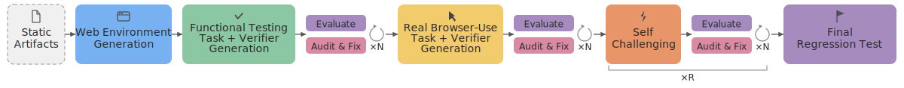

  <a href="https://TODO" style="text-decoration: none;"><svg width="16" height="16" viewBox="0 0 16 16" style="margin-right:3px"><circle cx="8" cy="8" r="6.5" fill="none" stroke="#4a7ec2" stroke-width="1.3"/><path d="M2,8 h12 M8,2 v12 M2.5,5 h11 M2.5,11 h11" fill="none" stroke="#4a7ec2" stroke-width="0.8"/><ellipse cx="8" cy="8" rx="3.5" ry="6.5" fill="none" stroke="#4a7ec2" stroke-width="1"/></svg>[Environment Hub]</a> &nbsp;&nbsp; <a href="https://github.com/TODO" style="text-decoration: none;"><svg width="16" height="16" viewBox="0 0 16 16" style="vertical-align:-2px;margin-right:3px"><path d="M8,1 C4.13,1 1,4.13 1,8 c0,3.09 2,5.71 4.78,6.64 .35,.06 .48-.15 .48-.34 0-.17-.01-.71-.01-1.29 -1.74,.32-2.2-.43-2.34-.82 -.08-.2-.42-.82-.72-.99 -.25-.13-.6-.45-.01-.46 .55-.01 .94,.51 1.07,.72 .63,1.05 1.63,.76 2.03,.58 .06-.45 .25-.76 .44-.93 -1.54-.17-3.15-.77-3.15-3.42 0-.76 .27-1.38 .72-1.87 -.07-.17-.31-.88 .07-1.84 0,0 .58-.19 1.92,.72 .56-.16 1.15-.23 1.74-.24 .59,.01 1.18,.08 1.74,.24 1.34-.91 1.92-.72 1.92-.72 .38,.96 .14,1.67 .07,1.84 .45,.49 .72,1.1 .72,1.87 0,2.66-1.62,3.25-3.16,3.42 .25,.22 .46,.63 .46,1.28 0,.93-.01,1.67-.01,1.9 0,.19 .13,.41 .48,.34 C13,13.71 15,11.08 15,8 15,4.13 11.87,1 8,1Z" fill="#6e40c9"/></svg>[GitHub]</a>

<figure class="wide">
  

    
  

  <figcaption>Browser agents navigating generated environments across diverse application domains.</figcaption>
</figure>

Realistic web environments with verifiable tasks are essential for training and evaluating general-purpose browser agents. However, constructing such environments remains prohibitively labor-intensive, requiring manual effort across sandbox creation, data curation, task design, and programmatic verifier authoring[^webarena][^osworld][^visualwebarena][^agentcompany]. The required expertise, often including significant programming effort, further limits scalability, confining large-scale environment construction largely to well-resourced organizations.

We aim to automate what has traditionally been a manual, expert-driven process. In this work, we propose an approach for automatically generating high-authenticity, high-complexity, and RL-ready environments—along with verifiable tasks—from static artifacts such as recorded workflows and user manuals using a multi-agent system. The resulting pipeline is both time- and cost-efficient: each environment can be generated within ten hours at a cost under $100, and the process is highly parallelizable.

A key insight of our approach is that coding agents with *privileged access* to source code and execution artifacts (e.g., task trajectories) can drive targeted and effective improvements. Rather than treating environments as black boxes, these agents can directly inspect, debug, and modify both environment implementations and task logic.
This capability enables an iterative, self-improving pipeline that performs cycles of generation, verification, and refinement ({@sec:approach}) to continuously improve (1) the functional correctness of the environment and (2) the correctness and difficulty of the verifiable tasks.

We further introduce a lightweight environment protocol that supports fast resets, easy replication, and scalable deployment, making the resulting environments well-suited for RL training without sacrificing realism ({@sec:env-protocol}).

Despite being fully automatically generated, our environments present a meaningful challenge for current browser agents. Strong models with a sophisticated harness (Gemini-3-Flash with Browser Use[^browseruse]) achieve an average success rate of 69.3%, while vision-based approaches such as Kimi-K2.5[^kimik25] and Qwen-3.5-Plus[^qwen35] achieve 45.9% and 49.1% respectively ({@sec:performance}). These results fall below their performance on established, manually constructed benchmarks such as WebArena and OSWorld, suggesting that our approach captures meaningful task complexity without manual design. Ablations further confirm the importance of key components ({@sec:ablations}).

In this initial release, we provide ten environments along with 1,260 verifiable tasks spanning multiple domains, including careers, DevOps, finance, healthcare, productivity, and project management. We additionally release 2,070 successful trajectories collected from various browser-use agents to support training and further research.

---

## Self Auditing and Self Challenging Environment and Verifiable Task Generation {#approach} [toc: Approach]
<figure class="wide">
  

    
  

  <figcaption>Overview of our approach</figcaption>
</figure>

Our approach coordinates two types of agents: a *coding agent*, which generates and repairs the web environment, tasks, and verifiers, and a *browser agent*, which executes tasks through the front-end UI in the same way as an end user. The pipeline proceeds in five stages. (1) The coding agent generates a web application conditioned on static artifacts such as recorded workflows and user manuals. (2) The coding agent produces functional testing tasks together with programmatic verifiers; the browser agent executes these tasks, and the coding agent audits failures, iterating up to N times to repair environment bugs. (3) The coding agent generates realistic, difficulty-graded tasks with verifiers, followed by the same evaluate-audit loop. (4) The coding agent analyzes the browser agent’s prior trajectories to synthesize progressively more challenging tasks over R rounds. (5) A final regression evaluation runs the full task suite to verify that edits introduced in later stages have not degraded functional correctness. We describe each component in detail below.

### Web Environment Generation
Although coding agents can generate arbitrary websites, unconstrained generation often produces environments that lack the structural fidelity needed to approximate real-world deployment conditions. We therefore condition generation on artifacts derived from real applications, specifically product user manuals. User manuals provide a strong foundation for environment construction: they describe core concepts, document task workflows, and often specify UI layout and interaction patterns (e.g., “click the top-right button to access settings”).

We select ten functional sections from eight applications, each corresponding to a coherent subset of product capabilities (e.g., the planning and tracking module of GitLab). The coding agent is given a detailed generation prompt together with the relevant manual sections; the full prompt is provided in the appendix. We defer discussion of specific implementation choices, such as UI element constraints, to the following section.

### Functional Correctness Verification
Although coding agents such as Claude Code may run many tests during web application generation, these checks do not guarantee functional correctness, particularlly front-end interaction. We therefore introduce a functional correctness verification stage in which the coding agent generates tasks and corresponding verifiers to test the basic functionality of the website.
A browser agent then executes these tasks through the front-end UI to assess whether they can be completed successfully in practice. These tasks are intentionally simple and fundamental; a capable browser agent should be able to complete them reliably. In our experiments, this set of tasks achieves a pass rate above 90% on average. We therefore use performance on this stage as an indicator of the website’s functional correctness.

**Auditing:** After the browser agent completes the tasks, we launch a separate coding agent as an auditing agent to review the recorded trajectories, with particular attention to failed cases, and produce an audit summary. The auditing agent determines whether each failure is attributable to an implementation bug or to limitations of the browser agent. It then fixes confirmed environment bugs accordingly. The auditing process terminates once the auditing agent concludes that the remaining failures are best explained by browser-agent error rather than implementation issues.

As a concrete example, one of the generated function tasks inside GitLab Plan & Track environment tests whether a user can delete an issue:

<figure class="wide">
  

    

      
Task definition

      <pre><code>{
  "id": "task_7",
  "instruction": "Delete the issue 'Markdown preview
    renders incorrectly with nested code blocks'.",
  "verify": "function-tasks/task_7.py"
}</code></pre>
    

    

      
Verifier

      <pre><code>def verify(server_url: str) -&gt; tuple[bool, str]:
    resp = requests.get(f"{server_url}/api/state")
    state = resp.json()
    issues = state.get("issues", [])
    target = next((i for i in issues
        if i["title"] == "Markdown preview renders "
           "incorrectly with nested code blocks"),
        None)
    if target is not None:
        return False, "Issue still exists."
    return True, "Issue has been deleted."</code></pre>
    

  

</figure>

While the backend logic supports this action, the browser agent failed to attempt this task due to missing the `delete` UI element.
The auditing agent identified this by reading the failed trajectory and applied the fix:

<pre style="background-color: var(--bg_code); border-radius: 0.2rem; padding: 1rem 2rem 1rem 1rem; overflow-x: auto;"><code>  html += '&lt;button class="btn btn-outline" data-action="edit-issue" ...&gt;Edit&lt;/button&gt;';
  html += '&lt;button class="btn ..." data-action="toggle-issue-status" ...&gt;Close issue&lt;/button&gt;';
+ html += '&lt;button class="btn btn-danger" data-action="delete-issue" ...&gt;Delete&lt;/button&gt;';</code></pre>

### Verifiable Realistic Task Generation and Hardening
The procedure for realistic task generation and auditing closely follows that of the previous stage, although it uses different prompts tailored to realistic task construction. In particular, we introduce explicit definitions of difficulty levels and provide examples of appropriate and inappropriate realistic tasks.

**Hardening:** Even with explicit difficulty-level guidance, coding agents still tend to generate tasks that are comparatively simple. We therefore introduce a hardening step in which the model reviews prior agent execution results and logs to assess the current capability frontier, and then continuously generates additional tasks that are more challenging. Below, we present several progressions from initial tasks to hardened tasks. In each case, the hardened task is not an artificial chain of unrelated actions; instead, it becomes more difficult through implicit prerequisites, conditional reasoning, or domain-specific constraints that arise naturally from the environment.

<figure class="wide">
<table style="width: 90%; margin: 0 auto; font-size: 0.92em; border-collapse: collapse; table-layout: fixed;">
  <colgroup>
    <col style="width: 14%;">
    <col style="width: 20%;">
    <col style="width: 28%;">
    <col style="width: 38%;">
  </colgroup>
  <thead>
    <tr>
      <th style="text-align:left; width: 16%;"></th>
      <th colspan="3" style="text-align:left; padding-bottom: 0.3em;">
        

          <strong>Increasing difficulty</strong>
          
          &#x25B6;
        

      </th>
    </tr>
  </thead>
  <tbody>
    <tr>
      <td style="vertical-align:top;"><strong>Career portal</strong> jobs &amp; events</td>
      <td style="vertical-align:top; background: rgba(76,175,80,0.04);"><em>"Save the Microsoft Software Engineer Intern position."</em></td>
      <td style="vertical-align:top; background: rgba(255,152,0,0.04);"><em>"Leave a comment on Jessica Park's post about her Meta return offer saying 'Congrats! Would love to hear more about your experience.'"</em></td>
      <td style="vertical-align:top; background: rgba(211,47,47,0.04);"><em>"RSVP to every upcoming event hosted by an employer (not the career center), and save each of those employers' active jobs you haven't saved yet."</em></td>
    </tr>
    <tr>
      <td style="vertical-align:top;"><strong>Prescriptions</strong> pharmacy queue</td>
      <td style="vertical-align:top; background: rgba(76,175,80,0.04);"><em>"Approve the pending Gabapentin refill request."</em></td>
      <td style="vertical-align:top; background: rgba(255,152,0,0.04);"><em>"Approve the Gabapentin refill request but change the sig to 'Take 1 capsule by mouth twice daily'."</em></td>
      <td style="vertical-align:top; background: rgba(211,47,47,0.04);"><em>"The patient's Penicillin allergy was cleared by recent testing. Remove it from the chart. Then discontinue the current Amoxicillin 500mg (the patient was hesitant to take it while the allergy was listed). Prescribe a fresh course of Amoxicillin-Clavulanate 875mg/125mg tablet twice daily for 10 days for acute sinusitis [..] send to CVS #4521."</em></td>
    </tr>
    <tr>
      <td style="vertical-align:top;"><strong>Presentations</strong> transition normalization</td>
      <td style="vertical-align:top; background: rgba(76,175,80,0.04);"><em>"Change the Thank You slide's transition type to push."</em></td>
      <td style="vertical-align:top; background: rgba(255,152,0,0.04);"><em>"Replace every dissolve transition in the deck with a push-left transition."</em></td>
      <td style="vertical-align:top; background: rgba(211,47,47,0.04);"><em>"Change the deck's default template style to Warm Sunset and set the default transition to slide_out from the bottom with bounce easing at 500ms. Also apply the 'with total' slide number format to every slide that currently uses the Minimal Dark template."</em></td>
    </tr>
    <tr>
      <td style="vertical-align:top;"><strong>Digital wallet</strong> payments &amp; offers</td>
      <td style="vertical-align:top; background: rgba(76,175,80,0.04);"><em>"Stop getting those weekly digest emails."</em></td>
      <td style="vertical-align:top; background: rgba(255,152,0,0.04);"><em>"Save all the food and drink cashback offers that are currently available."</em></td>
      <td style="vertical-align:top; background: rgba(211,47,47,0.04);"><em>"Transfer &#36;1,000 from savings to my main balance, then split it: convert &#36;500 to euros and invest &#36;500 in Bitcoin."</em></td>
    </tr>
  </tbody>
</table>
</figure>

### Configurations
We use Claude Code (Opus 4.6, high-effort setting with planning mode) as the coding agent, and Gemini-3-Flash with the Browser Use harness as the browser agent. We additionally equip the coding agent with a frontend-design skill to support web development. We note that stronger browser use agent can further improve the generation quality. However, such improvements introduce additional computational cost and reduce iteration efficiency.

---

## Design Choices
In this section, we highlight several key design choices that improve generation quality and make the environments more suitable for RL training at scale.

### Text-based Interaction as a First-Class Citizen
We deliberately design our environments to be compatible with browser agents that rely primarily on text-based observations, such as enhanced accessibility trees. This choice is motivated by the observation that language models remain more robust and generalize better when operating over textual representations. 
To support this, we encourage the use of accessibility best practices and browser-native UI elements that can be fully represented in the DOM (e.g., popups, dropdowns). This ensures that critical interface elements and interactions are consistently exposed to the agent. In addition, we disable vision input when using the browser agent to improve efficiency and execution speed, making the agent purely text-based.

### Enhancing Verifier Reliability
Verifier correctness is a critical requirement for RL training. To ensure reliability, we introduce two layers of guardrails: (1) Programmatic Sanity Check: We first run a program with privileged backend access to directly manipulate the application state and then invoke the same verifier used for agent evaluation. Since this execution path should be correct by construction, any failure indicates a likely issue with the verifier itself. This procedure is integrated into the environment generation pipeline, allowing the coding agent to automatically detect and fix verifier inconsistencies. (2) Automatic Auditing: As described earlier, we further employ an auditing agent to analyze failed task trajectories and identify whether failures stem from environment bugs or agent limitations. This provides an additional layer of validation for both task design and verifier correctness.

### Standalone Verifiers
Given full access to both application state and functionality, we design verifiers to be fully standalone through an exposed API. This cleanly separates verification from task execution. In contrast to prior work such as WebArena, which relies on browser-based inspection of rendered pages, our approach avoids the need for expensive browser-side validation and enables more efficient and reliable evaluation.

### The Environment Protocol {#env-protocol}

We design our environments to be lightweight, easily replicable, and efficiently resettable, without sacrificing realism. The core idea is a *state-sync protocol* that decouples application state from the UI rendering layer, enabling fast and reliable resets without requiring heavy infrastructure.
Each environment is implemented as a self-contained directory of static HTML/CSS/JS files, served by a lightweight Python HTTP server. The server exposes a minimal API:

<pre style="background-color: var(--bg_code); border-radius: 0.2rem; padding: 1rem 1.5rem; overflow-x: auto; line-height: 1.7;"><code>GET  /api/state   → current app state (JSON)
PUT  /api/state   → browser pushes state on every mutation
POST /api/reset   → restore seed state, send SSE reset event
GET  /api/events  → SSE stream for reset notifications
GET  /*           → static file serving</code></pre>
On initial load and after every user interaction, the browser serializes and pushes its full state to the server. The server records the first such update as an immutable *seed snapshot*. Upon reset, the server restores this snapshot in memory and broadcasts a reset event via Server-Sent Events (SSE). The browser listens for this event, reloads the seed state, and navigates back to the initial page. This design eliminates the need for database rollbacks, container restarts, or filesystem cleanup.

Because the system has no database, no external service dependencies, and no persistent storage beyond in-memory state, each environment is fully defined by its source directory. Replicating an environment reduces to copying files, and running multiple instances simply requires launching separate server processes on different ports. This design makes it straightforward to scale to many parallel RL rollouts on a single machine.

---

## Environment and Task Statistics

Overview of the ten generated environments.

<table style="width: 100%; white-space: nowrap;">
  <thead>
    <tr>
      <th style="text-align:left">Environment</th>
      <th style="text-align:left">Domain</th>
      <th style="text-align:left">Source</th>
      <th style="text-align:right">Tasks</th>
      <th style="text-align:right">Any-Agent Success</th>
    </tr>
  </thead>
  <tbody>
    <tr>
      <td style="text-align:left"><svg width="16" height="16" viewBox="0 0 16 16" style="vertical-align:-2px;margin-right:4px"><path d="M3,10 L8,7 L13,10" fill="none" stroke="#555" stroke-width="1.3" stroke-linecap="round" stroke-linejoin="round"/><rect x="2" y="10" width="12" height="3" rx="1.5" fill="none" stroke="#555" stroke-width="1.2"/><line x1="8" y1="7" x2="8" y2="4" stroke="#555" stroke-width="1.2" stroke-linecap="round"/><circle cx="8" cy="3" r="1.2" fill="#555"/></svg> Career Exploration</td>
      <td style="text-align:left">Careers</td>
      <td style="text-align:left">Handshake</td>
      <td style="text-align:right">200</td>
      <td style="text-align:right">144</td>
    </tr>
    <tr>
      <td style="text-align:left"><svg width="16" height="16" viewBox="0 0 16 16" style="vertical-align:-2px;margin-right:4px"><rect x="2" y="2" width="12" height="12" rx="2" fill="none" stroke="#555" stroke-width="1.2"/><line x1="6" y1="2" x2="6" y2="14" stroke="#555" stroke-width="1"/><line x1="10" y1="2" x2="10" y2="14" stroke="#555" stroke-width="1"/><circle cx="4" cy="6" r="1" fill="#555"/><circle cx="8" cy="8" r="1" fill="#555"/><circle cx="12" cy="5" r="1" fill="#555"/></svg> Project Planning</td>
      <td style="text-align:left">DevOps</td>
      <td style="text-align:left">GitLab</td>
      <td style="text-align:right">140</td>
      <td style="text-align:right">93</td>
    </tr>
    <tr>
      <td style="text-align:left"><svg width="16" height="16" viewBox="0 0 16 16" style="vertical-align:-2px;margin-right:4px"><path d="M4,2 L4,14 L12,14 L12,5 L9,2 Z" fill="none" stroke="#555" stroke-width="1.2" stroke-linejoin="round"/><path d="M9,2 L9,5 L12,5" fill="none" stroke="#555" stroke-width="1.2" stroke-linejoin="round"/><text x="8" y="11.5" text-anchor="middle" font-size="6" font-weight="600" fill="#555">$</text></svg> Accounting &amp; Invoicing</td>
      <td style="text-align:left">Finance</td>
      <td style="text-align:left">Xero</td>
      <td style="text-align:right">120</td>
      <td style="text-align:right">100</td>
    </tr>
    <tr>
      <td style="text-align:left"><svg width="16" height="16" viewBox="0 0 16 16" style="vertical-align:-2px;margin-right:4px"><rect x="2" y="4" width="12" height="9" rx="1.5" fill="none" stroke="#555" stroke-width="1.2"/><line x1="2" y1="7.5" x2="14" y2="7.5" stroke="#555" stroke-width="1"/><rect x="4" y="9.5" width="4" height="2" rx="0.5" fill="none" stroke="#555" stroke-width="0.8"/></svg> Personal Wallet</td>
      <td style="text-align:left">Finance</td>
      <td style="text-align:left">PayPal</td>
      <td style="text-align:right">140</td>
      <td style="text-align:right">133</td>
    </tr>
    <tr>
      <td style="text-align:left"><svg width="16" height="16" viewBox="0 0 16 16" style="vertical-align:-2px;margin-right:4px"><rect x="3" y="2" width="10" height="12" rx="1.5" fill="none" stroke="#555" stroke-width="1.2"/><line x1="8" y1="6" x2="8" y2="10" stroke="#555" stroke-width="1.3" stroke-linecap="round"/><line x1="6" y1="8" x2="10" y2="8" stroke="#555" stroke-width="1.3" stroke-linecap="round"/></svg> Clinical Records</td>
      <td style="text-align:left">Healthcare</td>
      <td style="text-align:left">Elation EHR</td>
      <td style="text-align:right">120</td>
      <td style="text-align:right">106</td>
    </tr>
    <tr>
      <td style="text-align:left"><svg width="16" height="16" viewBox="0 0 16 16" style="vertical-align:-2px;margin-right:4px"><ellipse cx="6" cy="8" rx="3.5" ry="5" fill="none" stroke="#555" stroke-width="1.2"/><ellipse cx="10" cy="8" rx="3.5" ry="5" fill="none" stroke="#555" stroke-width="1.2"/></svg> Prescription Management</td>
      <td style="text-align:left">Healthcare</td>
      <td style="text-align:left">Elation EHR</td>
      <td style="text-align:right">120</td>
      <td style="text-align:right">102</td>
    </tr>
    <tr>
      <td style="text-align:left"><svg width="16" height="16" viewBox="0 0 16 16" style="vertical-align:-2px;margin-right:4px"><path d="M2,4 L8,8 L14,4 L14,12 L2,12 Z" fill="none" stroke="#555" stroke-width="1.2" stroke-linejoin="round"/><line x1="2" y1="4" x2="14" y2="4" stroke="#555" stroke-width="1.2"/></svg> Email Management</td>
      <td style="text-align:left">Productivity</td>
      <td style="text-align:left">Gmail</td>
      <td style="text-align:right">60</td>
      <td style="text-align:right">55</td>
    </tr>
    <tr>
      <td style="text-align:left"><svg width="16" height="16" viewBox="0 0 16 16" style="vertical-align:-2px;margin-right:4px"><circle cx="6" cy="5.5" r="2.5" fill="none" stroke="#555" stroke-width="1.2"/><path d="M1.5,13 Q1.5,9 6,9 Q10.5,9 10.5,13" fill="none" stroke="#555" stroke-width="1.2"/><circle cx="11" cy="6" r="2" fill="none" stroke="#555" stroke-width="1"/><path d="M8.5,13 Q8.5,9.5 11,9.5 Q14,9.5 14,13" fill="none" stroke="#555" stroke-width="1"/></svg> Accounts &amp; Contacts</td>
      <td style="text-align:left">Productivity</td>
      <td style="text-align:left">Gmail</td>
      <td style="text-align:right">120</td>
      <td style="text-align:right">89</td>
    </tr>
    <tr>
      <td style="text-align:left"><svg width="16" height="16" viewBox="0 0 16 16" style="vertical-align:-2px;margin-right:4px"><path d="M2,4 L8,8 L14,4 L14,12 L2,12 Z" fill="none" stroke="#555" stroke-width="1.2" stroke-linejoin="round"/><line x1="2" y1="4" x2="14" y2="4" stroke="#555" stroke-width="1.2"/><path d="M1,2.5 L4.5,2.5 L4.5,6" fill="none" stroke="#555" stroke-width="1" stroke-linecap="round" stroke-linejoin="round"/><path d="M2,1.5 L1,2.5 L2,3.5" fill="none" stroke="#555" stroke-width="1" stroke-linecap="round" stroke-linejoin="round"/></svg> Email Client</td>
      <td style="text-align:left">Productivity</td>
      <td style="text-align:left">Superhuman</td>
      <td style="text-align:right">120</td>
      <td style="text-align:right">68</td>
    </tr>
    <tr>
      <td style="text-align:left"><svg width="16" height="16" viewBox="0 0 16 16" style="vertical-align:-2px;margin-right:4px"><circle cx="8" cy="8" r="5.5" fill="none" stroke="#555" stroke-width="1.2"/><circle cx="8" cy="8" r="1.5" fill="#555"/><line x1="8" y1="2.5" x2="8" y2="4" stroke="#555" stroke-width="1.2" stroke-linecap="round"/><line x1="8" y1="12" x2="8" y2="13.5" stroke="#555" stroke-width="1.2" stroke-linecap="round"/><line x1="2.5" y1="8" x2="4" y2="8" stroke="#555" stroke-width="1.2" stroke-linecap="round"/><line x1="12" y1="8" x2="13.5" y2="8" stroke="#555" stroke-width="1.2" stroke-linecap="round"/></svg> Account Settings</td>
      <td style="text-align:left">Project Mgmt</td>
      <td style="text-align:left">Linear</td>
      <td style="text-align:right">120</td>
      <td style="text-align:right">100</td>
    </tr>
    <tr style="font-weight: 600; background-color: rgba(74,126,194,0.1);">
      <td style="text-align:left">Total</td>
      <td style="text-align:left"></td>
      <td style="text-align:left"></td>
      <td style="text-align:right">1,260</td>
      <td style="text-align:right">990</td>
    </tr>
  </tbody>
</table>

We present summary statistics for the ten environments included in our initial release. As our pipeline is fully automated with minimal human intervention, we report in the final column the number of tasks for which at least one agent succeeds. This metric serves as a conservative lower bound on task validity and overall environment quality.

**Filtering Criteria**  In our manual examination, we find that the functional test success rate serves as a strong indicator of environment quality. We therefore use it as a primary filtering criterion, excluding any environments with a functional test pass rate below 50% from the release. While many of these issues are likely fixable with additional iterations, we apply this threshold to ensure a consistent quality bar without significant human intervention.

---

## Performance of Browser-use Agents {#performance}
<figure>
  

    
  

  <figcaption>Overall and breakdown success rate (%) of three browser-use agents </figcaption>
</figure> 

**Browser-use Agents** We evaluate a text-based browser agent using the Browser Use harness with `gemini-3-flash-preview` as the underlying model. The Browser Use harness supports both ID-based interaction and the ability to write and execute JavaScript, providing additional flexibility for complex operations. We also evaluate two vision-based agents, `kimi-k2.5` and `qwen-3.5-plus`. For these agents, we implement error-handling strategies, such as retry mechanisms, to mitigate limitations introduced by comparatively less sophisticated interaction harnesses.

Across 1,260 real tasks spanning ten environments, Gemini-3-Flash with Browser Use achieves 69.3% (873/1260), followed by Qwen-3.5-Plus at 49.1% (619/1260) and Kimi-K2.5 at 45.9% (578/1260). Performance varies considerably across environments, with PayPal My Wallet being the easiest environment for all agents. While Kimi-K2.5 underperforms Qwen-3.5-Plus overall, it surpasses Qwen-3.5-Plus by a significant margin on Gmail-related applications.

The success rates observed here are notably lower than those reported on established benchmarks. For example, Kimi-K2.5 achieves 58.9% on WebArena and 63.3% on OSWorld-verified, compared to 45.9% on our environments. Similarly, Qwen-3.5-Plus scores 62.2% on OSWorld-verified versus 49.1% in our environments.
These results suggest that our fully automated environment generation produces meaningfully challenging tasks while still leaving substantial room for future improvement, highlighting the potential of our approach at larger scale.

---

## Ablation Studies {#ablations}

In this section, we perform ablation studies to validate the necessity and impact of different components in our approach. 

### Richer Source Artifacts Yield More Complex and Authentic Environments [toc: Impact of the Artifacts]
<figure class="wide">
  

    
    
    
  

  <figcaption>Ablation comparing environments generated with full documentation (&#9632;&thinsp;blue) versus a brief description only (&#9632;&thinsp;red). Top-left: Number of unique functional operations. Top-right: Task diversity measured by mean 5-NN cosine distance of task embeddings. Bottom: Feature authenticity measured by precision and recall against the user manuals</figcaption>
</figure>

A central design decision in our pipeline is conditioning environment generation on artifacts. A natural question is: *how much does the richness of source artifacts matter?* To answer this, we conduct a controlled ablation comparing environments generated from full product documentation against those generated from a brief, high-level application description. We select five applications and generate paired environments with all other pipeline parameters held constant.

We evaluate the impact along three metrics, namely the function complexity, task diversity, and feature authenticity.

Expand to see the detailed metric definitions

<strong>Functional Complexity.</strong> We use Claude to extract distinct user-facing capabilities from each generated application's source code and count the number of unique functional operations implemented.

<strong>Task Diversity.</strong> We embed all real task instructions (excluding hardened tasks) using `Gemini Embedding 2` and measure the mean 5-nearest-neighbor cosine distance for each task set—higher values indicate that tasks are more spread out in semantic space rather than clustered around a few repetitive themes.

<strong>Feature Authenticity.</strong> We measure how faithfully each generated environment reproduces the capabilities of the real product. We use LLMs to extract user-facing capabilities from three sources—the product documentation, the generated application's source code, and the generated task instructions—producing short action phrases (e.g., "approve an invoice"). We then embed all extracted features using `Gemini Embedding 2` and compute precision and recall by matching each environment feature to its nearest documentation feature via cosine distance (threshold 0.2).

We observe consistent gains from documentation conditioning:

- **More capabilities implemented.** Manual-conditioned environments produce more unique functional operations in four out of five domains, with the largest gap in Xero Invoicing (96 vs. 64). The one exception, GitLab Plan & Track, we attribute to its documentation structure: a single menu-style markdown with hyperlinks rather than a self-contained folder.
- **More diverse tasks.** Tasks generated from documentation-conditioned environments are more spread out in semantic space with the clearest gains in Figma Slides (0.28 vs. 0.24) and Xero Invoicing (0.26 vs. 0.22).
- **More faithful to the real product.** Manual-conditioned environments achieve higher precision and recall across four out of five domains when matching generated features against documentation-derived capabilities—indicating that product manuals substantially reduce feature hallucination and improve feature coverage.

These results suggest that while coding agents can generate plausible environments from minimal specifications, more comprehensive artifacts improve the functional complexity, task diversity, and feature authenticity of the resulting environments.

### Auditing Improves Functionality and Verification Reliability [toc: Necessity of Auditing]
<figure class="wide">
  

    
    
  

  <figcaption>Left: Pre-audit to post-audit success rate of the browser-use agent on functional testing tasks. Right: Distribution of issues identified during auditing.</figcaption>
</figure>

We plot the success rate of the browser-use agent on functional testing tasks before and after multiple rounds of auditing across three environments. The evaluate–audit loop consistently improves functional correctness: all environments exhibit monotonically increasing pass rates over successive audit rounds. For example, in the Xero Invoicing environment, performance improves from 72% to 100% after auditing.

To better understand the nature of the issues uncovered, we analyze the auditing agent’s reports and categorize each identified failure. The distribution indicates that the auditing procedure does not simply attribute all failures to limitations of the browser-use agent.
Environment- and task-side errors, including application bugs, verifier bugs, and impossible tasks, account for 45% of all findings, while the remaining 55% are attributed to browser-agent limitations.
These results highlight the effectiveness of the auditing procedure in improving environment quality, as unresolved issues—particularly incorrect reward signals—would otherwise compromise downstream training.

### Self-Challenging Increases Task Difficulty and Complexity [toc: Effectiveness of Self-Challenging]
<figure>
  

    
  

  <figcaption>Average success rate of Gemini-3-Flash with Browser Use across different difficulty levels</figcaption>
</figure>

We compute the average success rate of Gemini-3-Flash with Browser Use across real tasks at different difficulty levels and observe a monotonic decrease in performance. In particular, the self-challenging stage produces tasks that are substantially more difficult than those generated in the initial round.
The browser agent’s average success rate drops from 54.2% on the original hard tasks to 41.9% on hardened tasks. This gap indicates that, while the original hard tasks are generated solely based on the website implementation, incorporating prior execution trajectories enables the coding agent to further identify and target weaknesses beyond this initial difficulty frontier.

### Limited Functional Regression Across Iterations [toc: Regression Test]
<figure>
<table style="width: auto; margin: 0 auto; font-size: 0.93em;">
  <thead>
    <tr>
      <th style="text-align:left">App</th>
      <th style="text-align:right">Initial</th>
      <th style="text-align:right">Final</th>
      <th style="text-align:right">&delta;</th>
    </tr>
  </thead>
  <tbody>
    <tr>
      <td>Elation Clinical</td>
      <td style="text-align:right">100.0%</td>
      <td style="text-align:right">98.2%</td>
      <td style="text-align:right; color: #1a7f37;">-1.8pp</td>
    </tr>
    <tr>
      <td>Xero Invoicing</td>
      <td style="text-align:right">98.3%</td>
      <td style="text-align:right">94.8%</td>
      <td style="text-align:right; color: #1a7f37;">-3.4pp</td>
    </tr>
    <tr>
      <td>GitLab Plan &amp; Track</td>
      <td style="text-align:right">98.2%</td>
      <td style="text-align:right">98.2%</td>
      <td style="text-align:right; color: #1a7f37;">+0.0pp</td>
    </tr>
    <tr>
      <td>PayPal My Wallet</td>
      <td style="text-align:right">96.4%</td>
      <td style="text-align:right">96.4%</td>
      <td style="text-align:right; color: #1a7f37;">+0.0pp</td>
    </tr>
    <tr>
      <td>Superhuman</td>
      <td style="text-align:right">93.3%</td>
      <td style="text-align:right">73.3%</td>
      <td style="text-align:right; color: #cf222e;">-20.0pp</td>
    </tr>
    <tr>
      <td>Elation Prescriptions</td>
      <td style="text-align:right">87.5%</td>
      <td style="text-align:right">89.3%</td>
      <td style="text-align:right; color: #1a7f37;">+1.8pp</td>
    </tr>
    <tr>
      <td>Elation Patient Comm.</td>
      <td style="text-align:right">75.9%</td>
      <td style="text-align:right">32.8%</td>
      <td style="text-align:right; color: #cf222e;">-43.1pp</td>
    </tr>
  </tbody>
</table>
<figcaption>Functional task pass rate before and after the full pipeline. Green indicates minor or no regression; red indicates significant regression.</figcaption>
</figure>

A natural concern with an iterative procedure is whether later stages introduce regressions in the base environment’s functional correctness, potentially invalidating previously generated tasks. 
To assess this, we compare the functional task pass rate at two points: immediately after the initial generation and auditing stage, and at the end of the full pipeline.
We observe that five out of seven environments maintain pass rates close to their initial levels, while two exhibit substantial regressions. These results suggest that, in most cases, functional correctness is preserved throughout the iterative process.
This analysis also enables us to filter out low-quality environments using simple heuristics without requiring manual inspection. For example, we manually interacted with the Elation Patient Communication environment and found it to be largely unusable, consistent with its degraded functional task pass rate. This reinforces the value of functional pass rate as an effective quality gate.

---

[^webarena]: Zhou et al. <a href="https://arxiv.org/abs/2307.13854">"WebArena: A Realistic Web Environment for Building Autonomous Agents."</a> ICLR, 2024.

[^osworld]: Xie et al. <a href="https://arxiv.org/abs/2404.07972">"OSWorld: Benchmarking Multimodal Agents for Open-Ended Tasks in Real Computer Environments."</a> NeurIPS, 2024.

[^visualwebarena]: Koh et al. <a href="https://arxiv.org/abs/2401.13649">"VisualWebArena: Evaluating Multimodal Agents on Realistic Visual Web Tasks."</a> ACL, 2024.

[^agentcompany]: Xu et al. <a href="https://arxiv.org/abs/2412.14161">"TheAgentCompany: Benchmarking LLM Agents on Consequential Real World Tasks."</a> ICLR, 2025.

[^browseruse]: Browser Use. <a href="https://github.com/browser-use/browser-use">"Enable AI to Access the Web."</a> GitHub, 2024.

[^kimik25]: Kimi Team. <a href="https://arxiv.org/abs/2602.02276">"Kimi K2.5: Visual Agentic Intelligence."</a> arXiv:2602.02276, 2026.

[^qwen35]: Qwen Team. <a href="https://qwen.ai/blog?id=qwen3.5">"Qwen3.5: Towards Native Multimodal Agents."</a> 2026.